# コンポーネント間の関係性と時刻情報を持つログを用いた異常箇所特定手法の検討

## 概要

Webサーバやアプリケーションなどのログの出力は時系列に1次元で出力されるのが主です。

ログはただ収集すれば良いわけではなく、最終的には統計や分析、サービスの異常箇所の特定などに活用できる必要があります。

しかし現在は、実現したいサービスやサービスを構成するアーキテクチャの複雑化に伴い、

- 単純にサーバの台数が複数台になる
- マイクロサービス化が進むことによりログを出力するサービスを構成するコンポーネントの種類が増加する
- 1つのコンポーネントが出力するログの種類が複数になる

となり、それぞれ単独のログ用いてのサービスの状態を把握することが困難になってきています。

筆者は、サービスを構成するコンポーネント群から異常箇所の特定し、かつそのログを確認したいと考えています。

そこで、筆者が検討を進めている「コンポーネント間の関係性と時刻情報を持つログを用いた異常箇所特定手法」について議論をしたいと考えています。

### アプローチ

まず、以下のような仮説を持っています。

1. コンポーネントA-B間で直接通信が発生している場合、それらのログの流量（時刻当たりのログの数）や特定のログの流量（エラーログなど）には相関がある
2. コンポーネントA-B間のログ流量の相関が小さくなった場合、コンポーネントA-Bどちらかで異常が発生した可能性が高くなる
3. コンポーネントA-B-C間でAに異常が発生した場合、A-Bのログ流量の相関は小さくなるが、B-C間のログ流量の相関は小さくならない（CはBと同様にエラーログの割合が上昇するだけ）

上記の仮説が成り立つ場合、コンポーネントA,B,CでABCそれぞれでログのエラーログの割合が上昇しても

- A-B-CでA-Bの相関が小さくなって、B-Cの相関がそのままだったら、異常コンポーネントはA
- A-B-CでA-Bの相関もB-Cの相関も小さくなったら、異常コンポーネントはB
- A-B-CでA-Bの相関はそのままで、B-Cの相関が小さくなったら、異常コンポーネントはC

というような特定ができるのではないかと考えています。

コンポーネント間の関係はもっと複雑なので（複数の関係があったり分岐していたり）、より高度な計算が必要そうですが、基本アイデアは上記のようなものです。

このアイデアの利点は以下のようなものです。

- ログのエラーレートがあがったとき、単一コンポーネントでみるとそのコンポーネントが原因でエラー発生しているようにみえるが、関係性を考慮すると他のコンポーネントに原因があることがわかる。
   - ABC全てでエラーログの割合があがっていても相関を見ることで、異常コンポーネントを特定できる
- 突発的なリクエスト数上昇が発生した場合、単一コンポーネントでみるとログの流量が上昇し異常に見えてしまうが、コンポーネント間の相関に影響がなければ、異常ではないと判断できる

### なぜログなのか

- 一般的に出力されているものだから
- HTTPリクエストに限らず様々な情報を様々なタイミングで出力できるから
- サービスを構成する主要なミドルウェアやソフトウェアだけをターゲットにしやすいから
    - 逆にディスク異常などは、本稿の異常特定の範囲にはしない
- ポジティブなログとネガティヴなログの2値を意図をもって出力できるから
- 最終的にログを見ることで原因特定までをしたいから

---

## 第2回WSA研での発表「サービスやアーキテクチャを考慮したパス構造を用いたログ保存について」についての評価

第2回WSA研では、[「サービスを構成するコンポーネント群から、 **特定のユーザ/プロジェクトの異常箇所の特定し** 、かつそのログを確認したい」という目的のもと、異常箇所特定の手法について、ログ保存時のパス構造に着目しました](https://github.com/k1LoW/wsa-sg-2nd-draft)。

以下の情報をログではなくログ保存のパス構造に含め、

- 時刻
- ID（サービスにおけるユーザやプロジェクトを分ける識別子）
- 自身のコンポーネントのID（サーバやサーバ内で稼働する代表的なミドルウェアなどに付与する識別子）
- 通信が伝搬してきた全てのコンポーネントのIDを伝搬順に

かつ、「サービスにおいて通信の正しい伝播経路を知っている（有向グラフを持っている）」という条件を持つことで、ディレクトリ構造からあるIDの異常の検知と箇所特定ができると考えました。

上記についての評価として

1. HTTPリクエストだけでなく、全ての通信にIDを付与する必要があり、全てのコンポーネントがIDを付与できるようにするには、実装コストが高い
    - 単純にコンポーネントが多いのでその分実装コストが積み重なる
    - HTTPリクエストなどであればヘッダの利用などが可能であるが、それ以外のもの（例えばRDBMSへのクエリ）にIDの付与や伝播をさせるのには実装コストが高い
2. 現在筆者が関わるサービスにおいては、ユーザやプロジェクト単体の異常検知特定よりも、サービス全体の異常検知特定のほうが必要であることがわかった
3. 複数種類のログの集約のためにはそれぞれのログのタイムスタンプをパースして同時系列上にすることができれば、ログの保存形式について指定する必要がないことがわかった

としました。

- 1と2より、特定のプロジェクトではなくサービス全体の異常特定にフォーカスすることにしました。
- 3については、具体的に[Harvest](https://github.com/k1LoW/harvest)というログ収集ツールを作成し、実現可能であることを示しました。また、このツールにより本稿での検討のためのサンプリングが容易になりましたので今後検証データを集めていこうとかんがえています。
- コンポーネント間のグラフという情報は、サービス運用の経験則から、やはり重要な情報であるという気持ちを強めました。
    - ただ、今の所は無向グラフなログしか取得できないことが多い/無向グラフで十分かもしれないとも考えています。
